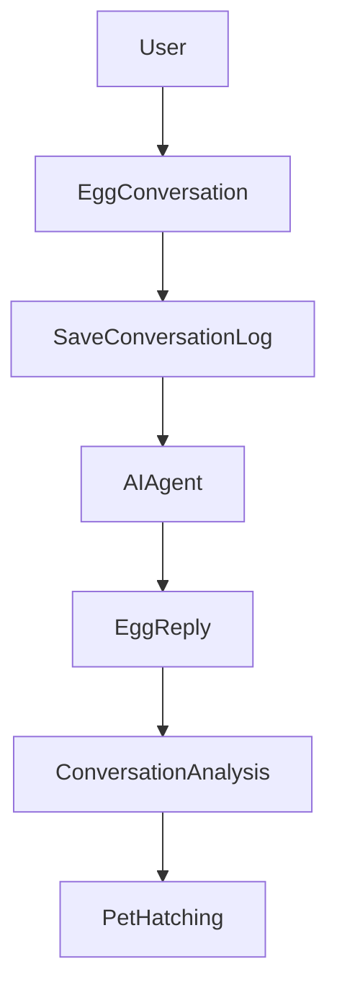
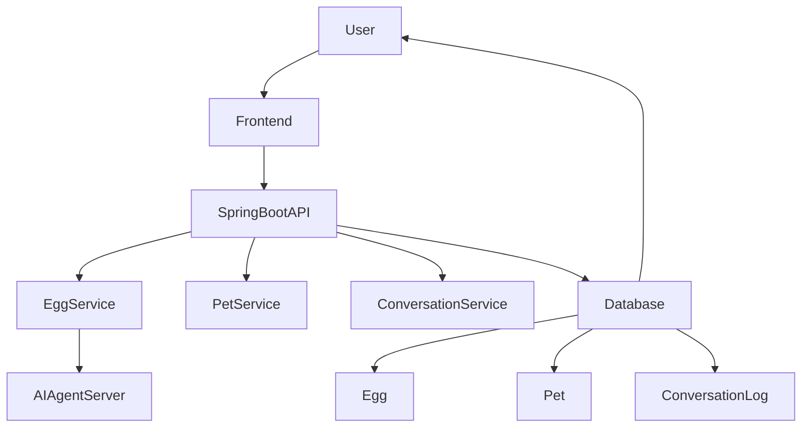
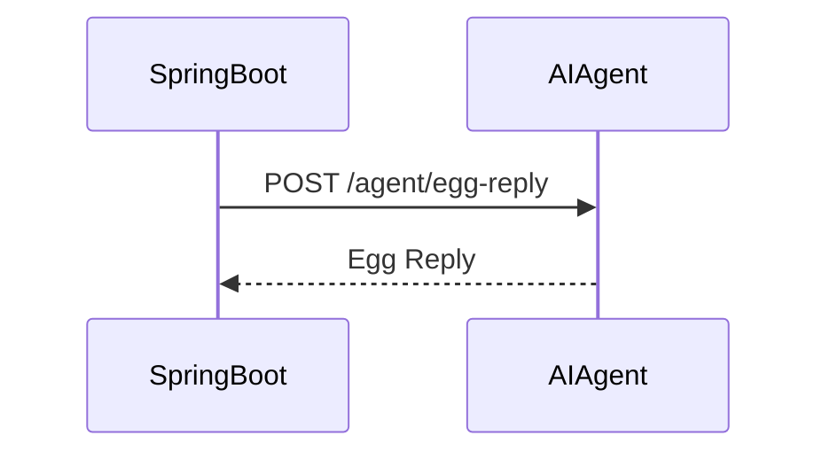

🐣 AnimAI

AnimAI는 사용자와의 대화를 통해 탄생하는 AI 다마고치 서비스입니다.

사용자는 알(Egg) 과 대화를 나누며 감정과 이야기를 쌓아가고,
그 대화 기록을 기반으로 세상에 하나뿐인 AI 펫(Pet) 이 부화합니다.

대화 속 키워드와 분위기를 분석하여 펫의 종(species) 과 성격(personality) 이 결정됩니다.

"대화로 태어나는 나만의 AI Companion"

🧠 Service Concept

AnimAI는 단순한 가상 펫 서비스가 아니라
사용자의 대화와 감정을 기반으로 성장하는 AI Companion을 목표로 합니다.

사용자의 말과 감정이 기록되고
그 기록이 하나의 디지털 생명체를 만들어냅니다.

🔄 Service Flow



사용자의 대화 데이터가 축적되면서
펫의 종과 성격이 결정됩니다.

✨ Key Features

🥚 Egg Conversation

사용자는 알(Egg) 과 대화를 나눌 수 있습니다.

대화는 모두 ConversationLog에 저장되며
AI Agent 서버와 통신하여 알이 응답합니다.

```text
USER → Egg → AI Agent → Egg Reply
```

🐾 Pet Hatching

대화를 충분히 나눈 후 알을 부화(hatch) 시킬 수 있습니다.

대화 로그의 키워드를 분석하여 펫이 생성됩니다.

키워드	생성되는 펫

- 숲 / 나무 / 초록	숲속 여우
- 바다 / 파도	바다 물고기
- 불 / 드래곤	작은 드래곤
- 하늘 / 별	별빛 고양이

💬 Conversation Memory

모든 대화는 ConversationLog에 기록됩니다.

ConversationLog

```text
 ├ USER 메시지
 └ EGG 메시지
```

이 데이터는 향후 다음 기능에 활용될 수 있습니다.

- 펫 성장 시스템
- 감정 분석
- AI 성격 진화
- 장기 기억 시스템

🏗 System Architecture



🤖 AI Agent Integration

AnimAI는 외부 AI Agent 서버와 통신하여
알(Egg)의 응답을 생성합니다.



⚙️ Tech Stack

Backend
- Spring Boot
- Spring Data JPA
- MySQL
- RestTemplate

AI
- Agent 기반 대화 응답 생성
- 대화 로그 기반 펫 생성

Infrastructure
- REST API Server
- AI Agent Server 연동

📂 Project Structure
```text
animai
 ├ domain
 │  ├ User
 │  ├ Egg
 │  ├ Pet
 │  └ ConversationLog
 │
 ├ repository
 │  ├ UserRepository
 │  ├ EggRepository
 │  ├ PetRepository
 │  └ ConversationLogRepository
 │
 ├ service
 │  └ EggService
 │
 ├ dto
 │  ├ EggMessageResponse
 │  └ agent
 │
 └ controller
```

🧩 Core Logic

AnimAI의 핵심은 대화 기반 펫 생성 시스템입니다.

1️⃣ Egg 대화

```text
talkToEgg(userId, message)

동작 과정

유저 조회

현재 알 조회 (없으면 생성)

USER 메시지 저장

전체 대화 로그 조회

AI Agent 호출

Egg 응답 생성

ConversationLog 저장
```

2️⃣ Pet 부화

```text
hatchEgg(userId, eggId)

동작 과정

알 소유자 검증

부화 여부 확인

대화 로그 분석

Pet 생성

Egg 상태 업데이트
```

3️⃣ 대화 기반 펫 생성 로직

```java
if (containsAny(lower, "숲", "나무", "초록")) {
    species = "숲속 여우";
}
```

향후 확장
- LLM 기반 성격 생성
- 감정 분석
- 장기 기억 시스템

🌐 API Server

AnimAI Backend
```http
https://animai-tolx.onrender.com/
```

AI Agent Server
```http
POST /agent/egg-reply
```

🚀 Future Plans

AnimAI는 단순한 다마고치 서비스에서
AI Companion 플랫폼으로 확장할 계획입니다.

예정 기능

```text
🧠 LLM 기반 펫 성격 생성

🎭 감정 기반 반응 시스템

📈 펫 성장 시스템

🧬 펫 진화 시스템

🌎 사용자 간 펫 교류
```

💡 Motivation

AnimAI는 다음 질문에서 시작되었습니다.

"AI가 단순한 도구가 아니라
나와 함께 성장하는 존재가 될 수 있을까?"

사용자의 말과 감정이 기록되고
그 기록이 하나의 생명체가 되는 경험.

AnimAI는 AI와 인간의 관계를 새롭게 정의하는 실험적인 프로젝트입니다.
